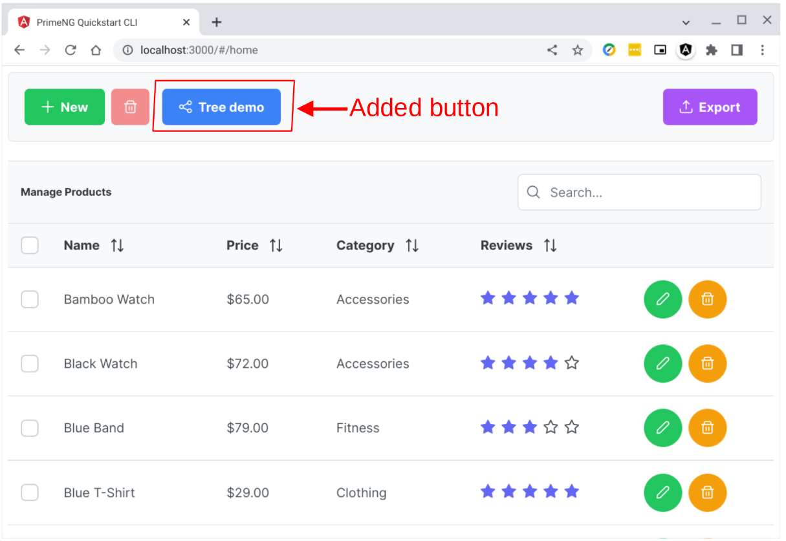
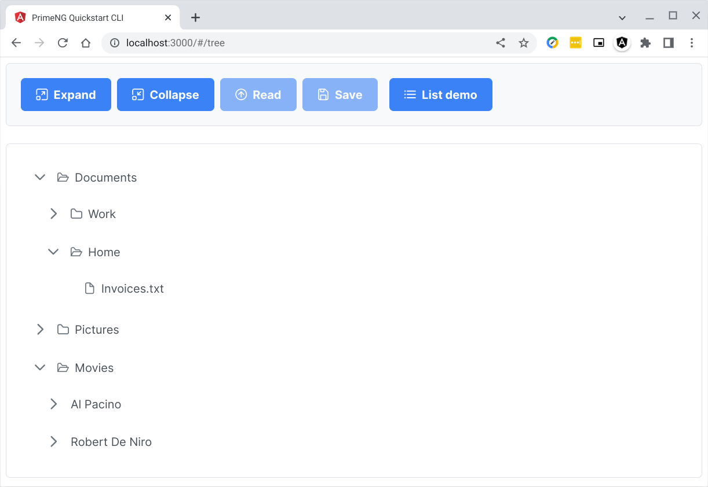

# treemodule-json

## Feed JSON data to a tree component

> ***This tutorial requires some knowledge in Linux, Angular, TypeScript, and Primeng components.***

## Purpose

This is a simple demo that introduces the idea of using Angular's singleton service as the canonical source of application state or a particular data your app may need.

I use a basic existing public demo code and simply tweak them into how I would like to see them coded if I were the **IT Manager** or **Tech Lead**. A simple solid basic foundation wards off a lot of future refactoring headaches.

My goal is to preach the idea that components are for UI display. Application state, data, and logic must be off-loaded to a service.

When your app expands in features and functionality, components that need access to a central state or data can be loosely coupled using observables defined within a service.

## Why Angular?

I am way far from an Angular expert. It took me about 6 months to grok Angular. It has a steep learning curve but it was worth it. I have dabbled with React, Vue, and etc. and I like them all.

However I have gravitated towards Angular because, it being a SPA framework, it has the semblance of the classic fat-client app but uses standard web tech (HTML, JavaScript, and CSS). And code in Angular is written in TypeScript that once you get used to it, it gets hard to go back to plain JavaScript.

Angular has built-in formalizations of stuff like Components, Directives, Dependency Injection, Singleton Service, PWA web service worker, RxJS Observables, Jasmine-Karma testing, and etc. These are all built-in baked into Angular. In other frameworks they may be provided by separate and disparate 3rd-party library.

Most of these parts in Angular are entangled in functionality as well. For example RxJS is a key foundation of Angular itself. When you as much as scratch the surface of the component life-cycle you must read-up on RxJS using Observables. Observables are useful in loosely coupling components.

Angular is a platform itself. It also includes tools to expand Angular. All these features are nice but they also contribute toward its steep learning curve.

## Project structure

The [src/server](./src/server/README.md) folder will contain the Go server-side app. In succeeding iteration of this project, this folder it will contain files. As of now it is empty. The [src/pgsql](./src/pgsql/README.md) folder will contain the Postgresql code. For now this folder is also empty.

The [src/client](./src/client/README.md) folder contains the Angular project. For now our focus is this [src/client](./src/client/README.md) folder.

You might want to read how to [Dockerize your Angular dev environment](https://github.com/cydriclopez/docker-ng-dev) as it will come handy in this tutorial.

## How to run the code

Steps to run this project:
1. Using git clone this project into a working folder
2. Alter your ***angular*** alias command in ***~/.bashrc*** file
3. Run the ***angular*** alias then ***cd*** into ***src/client*** folder
4. Run ***npm install*** in the ***src/client*** folder
5. Run ***ng serve --host 0.0.0.0***

After ***step 5*** we will have a short discussion on the simple code in this demo.

Let us get started. Again, I suggest that you read how to [Dockerize your Angular dev environment](https://github.com/cydriclopez/docker-ng-dev) as it will come handy in this tutorial.

### 1. Using git clone this project into a working folder

**Carefully** follow my steps below. Your path will be different. <ins>**You will have to use your own path here.**</ins>

For example in my laptop, I make a folder ***github_02***.

```bash
user1@penguin:~/Projects$
:mkdir -p ~/Projects/github_02

user1@penguin:~/Projects$
:cd ~/Projects/github_02

user1@penguin:~/Projects/github_02$
:git clone https://github.com/cydriclopez/treemodule-json.git

Cloning into 'treemodule-json'...
remote: Enumerating objects: 71, done.
remote: Counting objects: 100% (71/71), done.
remote: Compressing objects: 100% (58/58), done.
remote: Total 71 (delta 6), reused 62 (delta 3), pack-reused 0
Receiving objects: 100% (71/71), 334.07 KiB | 2.76 MiB/s, done.
Resolving deltas: 100% (6/6), done.

user1@penguin:~/Projects/github_02$
:cd treemodule-json/src/client

user1@penguin:~/Projects/github_02/treemodule-json/src/client$
:pwd

/home/user1/Projects/github_02/treemodule-json/src/client
```

Note the result of the ***pwd*** command which stands for ***print working directory***. Note this path as we will need this path in the next steps.

### 2. Alter your ***angular*** alias command in ***~/.bashrc*** file

Note that the previous ***pwd*** command returned the current path. Your path will be different. <ins>**You will have to use your own path here.**</ins>

```bash
/home/user1/Projects/github_02/treemodule-json/src/client
```

You will have to alter the ***alias angular*** command in your ***~/.bashrc*** accordingly by adding another ***-v*** volume mapping. <ins>**You will have to use your own path here.**</ins> However try maintain the container mapping into the ***:/home/node/ng/treemodule-json*** folder.

```bash
# Setup Docker Angular working environment
alias angular='docker run -it --rm \
-p 4200:4200 -p 9876:9876 \
-v /home/user1/Projects/ng:/home/node/ng \
-v /home/user1/Projects/github_02/treemodule-json/src/client\
:/home/node/ng/treemodule-json \
-w /home/node/ng angular /bin/sh'
```

Reload the ***~/.bashrc*** file using the command: ***source ~/.bashrc***.

```bash
:source ~/.bashrc
```

### 3. Run the ***angular*** alias then ***cd treemodule-json*** folder

After ***~/.bashrc*** script file reloads then the ***angular*** alias command becomes available. The ***angular*** alias command brings us into the Angular Docker container. Note that the prompt changes to ***/home/node/ng #***.

Then here we issue the command ***cd treemodule-json*** to change folder. Note that in the previous step we mapped this folder to our host PC's folder ***/home/user1/Projects/github_02/treemodule-json/src/client***. <ins>**Note that you will have to use your own path here.**</ins>

```bash
:angular

/home/node/ng #

/home/node/ng # cd treemodule-json

/home/node/ng/treemodule-json #
```

### 4. Run ***npm install*** in the ***treemodule-json*** folder

```bash
/home/node/ng/treemodule-json # npm install
...
[truncated Angular messages]
...
? Would you like to share anonymous usage data with the Angular Team at Google under
Google’s Privacy Policy at https://policies.google.com/privacy? For more details and
how to change this setting, see https://angular.io/analytics. (y/N) n
...
[truncated Angular messages]
...
added 1211 packages from 1217 contributors and audited 1229 packages in 110.928s

101 packages are looking for funding
  run `npm fund` for details
...
[truncated Angular messages]
...
/home/node/ng/treemodule-json #
```

### 5. Run ***ng serve --host 0.0.0.0 --disable-host-check***

After ***npm install** has done installing the requisite software then we are ready to run this demo.

In the command we include the parameters ***--host 0.0.0.0 --disable-host-check*** to tell the Angular development server to:
1. "--host 0.0.0.0" - listen on all Ethernet devices
2. "--disable-host-check" - don't verify connected clients are part of allowed hosts.

However the Angular dev server still comes up with a warning message. We are not using it for production use so we are just fine.

```bash
/home/node/ng/treemodule-json #

/home/node/ng/treemodule-json # ng serve --host 0.0.0.0 --disable-host-check

Warning: Running a server with --disable-host-check is a security risk. See https://medium.com/webpack/webpack-dev-server-middleware-security-issues-1489d950874a for more information.

✔ Browser application bundle generation complete.

Initial Chunk Files   | Names         |      Size
vendor.js             | vendor        |   3.81 MB
styles.css, styles.js | styles        | 455.09 kB
polyfills.js          | polyfills     | 427.91 kB
main.js               | main          |  58.33 kB
runtime.js            | runtime       |   6.88 kB

                      | Initial Total |   4.74 MB

Build at: 2022-07-16T19:26:37.034Z - Hash: 86e502b6a33c0190 - Time: 13806ms

** Angular Live Development Server is listening on 0.0.0.0:4200, open your browser on http://localhost:4200/ **


✔ Compiled successfully.
```

### Discussion on the simple code in this demo

This demo code started life as a clone of the [PrimeNG Angular-CLI](https://github.com/primefaces/primeng-quickstart-cli) project. It is the quickest way to scaffold your project using the Primeng UI components. I have looked around for various UI component libraries and have learned to like Primeng.

I added the ***Tree Demo*** button to display the tree-demo page:<br/>


Note that I implemented the routing right in [app.module.ts](https://github.com/cydriclopez/treemodule-json/blob/main/src/client/src/app/app.module.ts). Most usually routing is implemented in a separate class file ***app-routing.module.ts***. This is a very small app so I decided to just plug the routing code right in ***app.module.ts***.

To implement routing we have to have the key pieces in the following listing.

```typescript
import { RouterModule, Routes } from '@angular/router';
    .
    :
        RouterModule.forRoot([
            {
                path: '', component: HomeComponent,
                children: [
                    {path: '', component: AppComponent},
                    {path: 'home', component: AppComponent},
                    {path: 'tree', component: TreedemoComponent},
                ]
            },
            {path: '**', redirectTo: ''},
        ], {useHash: true})

     ],
     exports: [RouterModule],
    .
    :
    bootstrap: [HomeComponent]
```

The original bootstrap value was:

```typescript
    bootstrap: [AppComponent]
```

I reset the line to  ***bootstrap: [HomeComponent]*** because this component now hosts the router outlet tag. I created [src/app/home/home.component.html](https://github.com/cydriclopez/treemodule-json/blob/main/src/client/src/app/home/home.component.html) to host the ***router-outlet*** tag which the router uses as outlet.

```html
<router-outlet></router-outlet>
```


This is the ***Tree Demo*** and clicking on ***List Demo*** brings you back to the previous list-demo page.<br/>


This ***Tree Demo*** page started life as the [Primeng tree-demo](https://www.primefaces.org/primeng/tree). Here is the [StackBlitz tree-demo](https://stackblitz.com/edit/primeng-tree-demo?file=src%2Fapp%2Fapp.component.ts). Go over this code. I did not copy it exactly. I just used the lower tree and adapted the ***Expand*** and ***Collapse*** buttons. For demo purposes this code is perfectly fine.

However, the moment your code takes on the semblance of a half-decent app then you stop coding this way. The component is mostly for UI display. Most of the logic have to be transitioned to the service.

Below is my suggestion of how to code it. Btw the ***selector: 'app-treedemo'*** becomes useless and is now preempted by the ***router-outlet*** tag mentioned above. So here I commented it.

```typescript
import { Component, OnInit } from '@angular/core';
import { NodeService } from '../services/nodeservice';

@Component({
  // selector: 'app-treedemo',
  templateUrl: './treedemo.component.html',
  styleUrls: ['./treedemo.component.css'],
})
export class TreedemoComponent implements OnInit {

    constructor(private nodeService: NodeService) { }

    public get files() {
        return this.nodeService.files;
    }

    ngOnInit() { }

    expandAll() {
        this.files.forEach( node => {
            this.nodeService.expandRecursive(node, true);
        });
    }

    collapseAll() {
        this.files.forEach( node => {
            this.nodeService.expandRecursive(node, false);
        });
    }

    saveToexpend(event) {
        this.nodeService.saveToexpend(event);
    }
}
```

This is the service used by the above component. Note that it is a singleton as denoted by the ***providedIn: 'root'*** in the ***@injectable()*** decorator. The declaration of interface ***TreeNode2***, which extends ***TreeNode***, can be moved to a separate file but instead I declared it here for compactness.

```typescript
import { HttpClient } from '@angular/common/http';
import { Injectable } from '@angular/core';
import { TreeNode } from 'primeng/api';

export interface TreeNode2 extends TreeNode {
    toexpand?:      boolean;
    /**
     * Hint: You can expand this to implement whatever
     * data you want persisted in this recursive structure
     * and to support whatever operation you want done on
     * the client or in the server.
     */
}

@Injectable({
    providedIn: 'root',
})
export class NodeService {

    files: TreeNode2[];

    constructor(private http: HttpClient) {
        this.getFiles().then(files => this.files = files);
    }

    getFiles() {
        return this.http.get<any>('assets/data/files.json')
        .toPromise()
        .then(res => <TreeNode2[]>res.data);
    }

    expandRecursive(node: TreeNode2, isExpand: boolean) {
        node.expanded = node.toexpand = isExpand;
        if (node.children) {
            node.children.forEach( childNode => {
                this.expandRecursive(childNode, isExpand);
            });
        }
    }

    resetRecursive(node: TreeNode2) {
        node.expanded = node.toexpand;
        if (node.children) {
            node.children.forEach( childNode => {
                this.resetRecursive(childNode);
            });
        }
    }

    saveToexpend(event) {
        event.node.toexpand = event.node.expanded;
        console.log(
            'label:', event.node.label,
            '\ntoexpand:', event.node.toexpand
        );
    }

}
```
Still under construction... 😊

---
